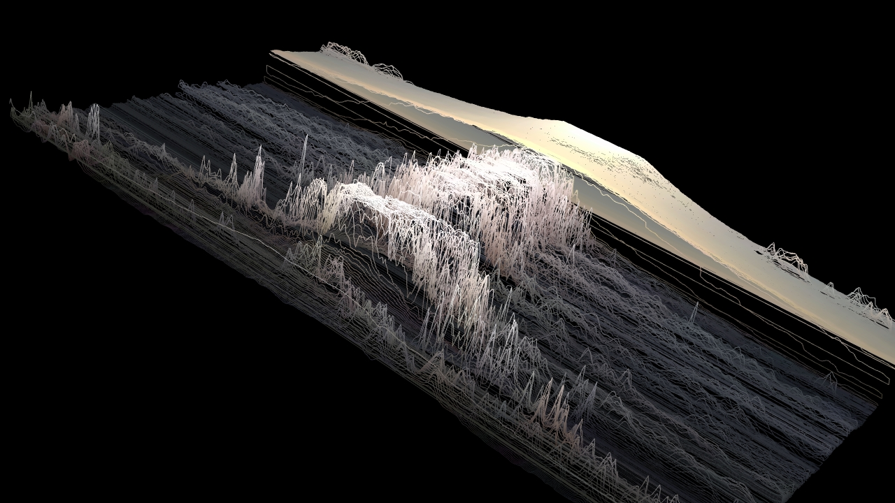

# Rutt-Etra TouchDesigner Component 
Implementation of Rutt-Etra video synthesizer in TouchDesigner using GLSL shaders. 

## Demo


## Usage
Everything is in a self contained ```Tox``` with custom parameters. You just have to feed it a movie, and set how many steps you'd like in both X and Y. The ```Tox``` has a handful of parameters in the ```Settings``` page. I used the ArcBall camera from the palette as the camera on the main container, so you don't need to go inside the component. You can adjust the step size to get higher or lower resolution outputs (lower resolution means less lines).

## Build and Version
Tested with TouchDesigner 088 64-bit Build 57100 with GLSL version 4.3.

## Attribution
- [Repo that I used to learn the implementation](https://github.com/jdiedrick/Rutt-Etra-Test)

If you like the repo and find it useful, feel free to give us (nVoid) a shoutout and let us know what you're working on! 
